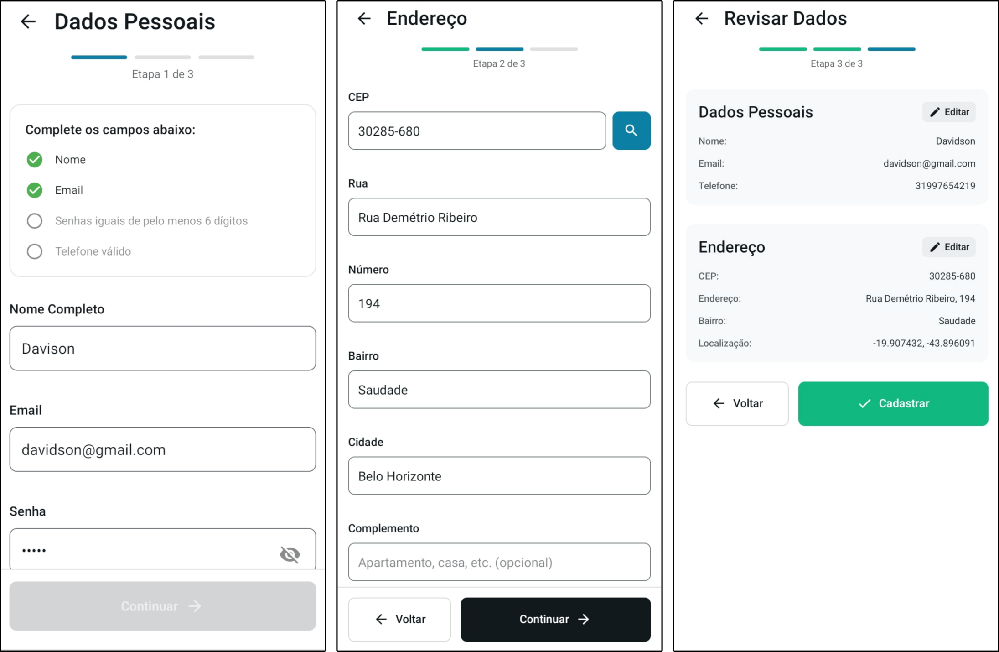
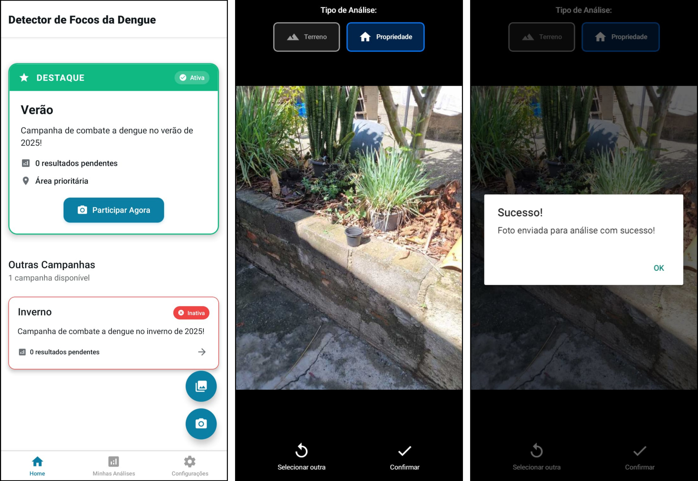
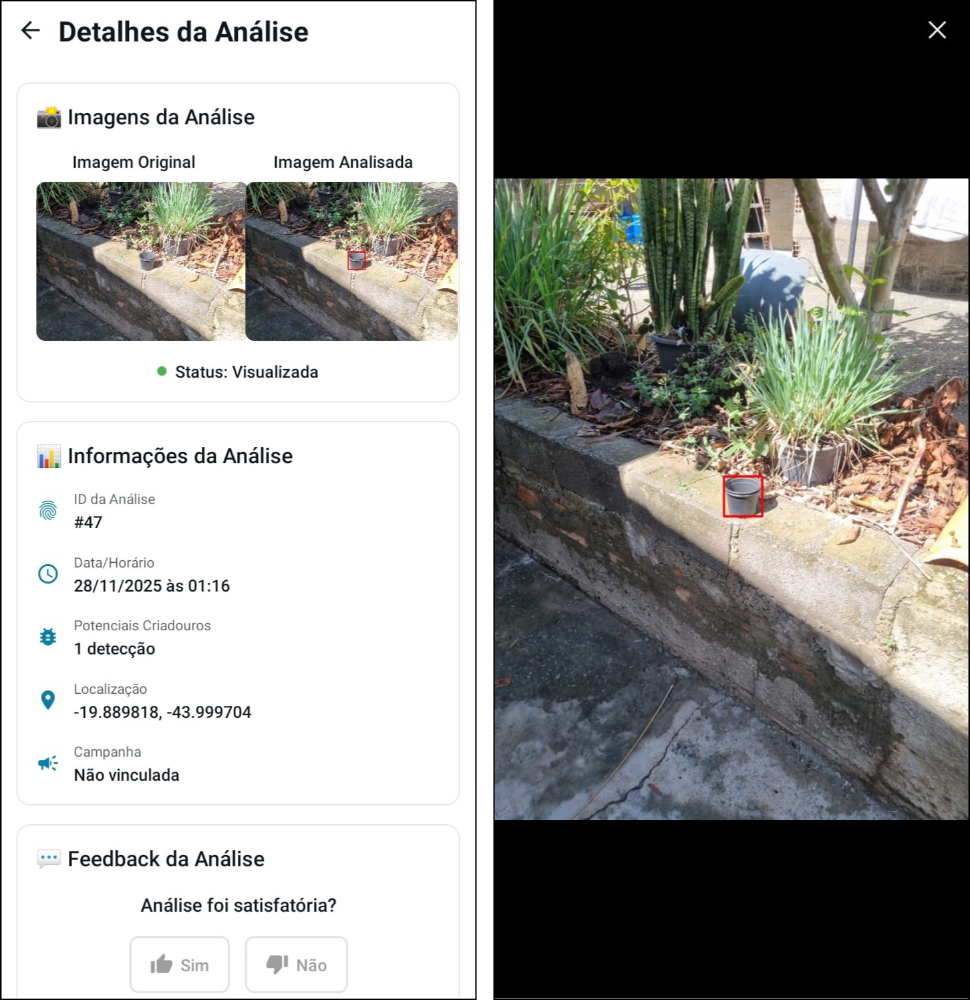

# Mosquito Camera - Aplicativo Móvel

Aplicativo móvel desenvolvido para cidadãos capturarem e enviarem imagens de potenciais criadouros do mosquito **Aedes aegypti**, que são processadas por um sistema de **visão computacional** e **inteligência artificial** para detecção automática.

## 📋 Sobre o Projeto

Este aplicativo faz parte de um sistema integrado de combate ao **Aedes aegypti** que utiliza **visão computacional** e **inteligência artificial** para identificar automaticamente potenciais criadouros do mosquito em imagens enviadas pela população.

O sistema foi desenvolvido como Trabalho de Conclusão de Curso (TCC) em Engenharia de Computação da PUC Minas, utilizando a arquitetura **YOLOv12** para detecção de objetos em imagens.

### 🎯 Objetivo

Permitir que cidadãos participem ativamente do combate às arboviroses através de uma ferramenta simples e acessível que:

- Facilita o envio de imagens de quintais e terrenos

- Processa automaticamente as imagens utilizando IA

- Exibe resultados de detecção em tempo real

- Permite feedback dos usuários para melhorar o modelo

- Integra com campanhas de saúde pública

## 📱 Download do Aplicativo

**APK para Android:** [Baixar APK](https://drive.google.com/file/d/1HOnxv3qVMAGiNVke45Xuy1oZMFLGCYxv/view?usp=sharing)

> **Nota:** Você precisará permitir a instalação de aplicativos de fontes desconhecidas nas configurações do seu dispositivo Android.

### 🔑 Credenciais de Exemplo

Para testar o aplicativo, utilize as seguintes credenciais:

- **Email:** `davidsonmarra@gmail.com`
- **Senha:** `senha@123`

## 🖼️ Imagens do Aplicativo

### Fluxo de Cadastro

O uso do aplicativo começa pelo cadastro do usuário, realizado com e-mail e senha. Nesse processo, são solicitadas informações básicas, como o endereço residencial. Estes dados são essenciais para o georreferenciamento das imagens capturadas.



### Fluxo de Envio de Imagem

Após o cadastro e autenticação, o usuário pode submeter imagens de três formas distintas: participando de uma campanha específica criada pelos gestores de saúde, fazendo upload de fotografias já existentes na galeria do dispositivo, ou capturando as imagens diretamente pela câmera do smartphone.



### Resultados da Análise

Após o envio da imagem, o sistema processa a fotografia através do pipeline de detecção. Uma vez concluído o processamento, o aplicativo apresenta ao usuário os resultados da análise, exibindo a imagem original com as regiões detectadas como potenciais criadouros destacadas visualmente. Cada detecção é apresentada com um retângulo delimitador, permitindo que o morador identifique claramente quais objetos foram classificados como potenciais focos.



## 🚀 Funcionalidades

### Para Cidadãos

- ✅ **Cadastro e autenticação** de usuários

- ✅ **Captura de imagens** via câmera ou seleção da galeria

- ✅ **Participação em campanhas** de combate ao mosquito

- ✅ **Visualização de resultados** de detecção em tempo real

- ✅ **Sistema de feedback** para validação das detecções

- ✅ **Histórico de análises** realizadas

- ✅ **Interface intuitiva** e fácil de usar

### Fluxo de Funcionamento

1. **Usuário** captura ou seleciona uma imagem do quintal/terreno

2. **Aplicativo** envia a imagem para o backend com geolocalização

3. **Sistema de IA** processa a imagem utilizando o modelo YOLOv12

4. **Resultados** são exibidos no aplicativo com objetos detectados marcados

5. **Usuário** pode fornecer feedback sobre a precisão das detecções

6. **Gestores** visualizam os dados no portal web para tomada de decisões

## 🛠️ Tecnologias Utilizadas

### Frontend (Aplicativo Móvel)

- **React Native 0.79.6** - Framework multiplataforma

- **Expo ~53.0.23** - Plataforma de desenvolvimento

- **Expo Router ~5.1.7** - Roteamento baseado em arquivos

- **TypeScript 5.8.3** - Tipagem estática

- **React Navigation** - Navegação entre telas

- **Expo Camera** - Acesso à câmera

- **Expo Location** - Geolocalização

- **Expo Image Picker** - Seleção de imagens da galeria


## 📁 Estrutura do Projeto

```
mosquito-camera/
├── app/                    # Rotas e telas do aplicativo (Expo Router)
│   ├── (tabs)/            # Telas com navegação por abas
│   │   ├── home.tsx       # Tela inicial
│   │   ├── my-analyses.tsx # Minhas análises
│   │   └── settings.tsx   # Configurações
│   ├── camera.tsx         # Tela de captura de imagens
│   ├── analysis-detail.tsx # Detalhes de uma análise
│   ├── campaign-detail.tsx # Detalhes de campanha
│   └── register*.tsx      # Telas de cadastro
├── components/            # Componentes reutilizáveis
│   ├── analysis/         # Componentes relacionados a análises
│   ├── campaign/         # Componentes de campanhas
│   ├── form/             # Componentes de formulários
│   ├── input/            # Componentes de entrada
│   └── ui/               # Componentes de interface
├── services/              # Serviços de API
│   ├── analysis.ts       # Serviço de análises
│   ├── auth.ts           # Autenticação
│   ├── campaign.ts       # Campanhas
│   ├── feedback.ts       # Feedback dos usuários
│   ├── location.ts       # Geolocalização
│   └── user.ts           # Dados do usuário
├── hooks/                 # React Hooks customizados
│   ├── useCampaigns.ts   # Hook para campanhas
│   └── useUserAnalyses.ts # Hook para análises
├── types/                 # Definições TypeScript
│   ├── Analysis.ts       # Tipos de análise
│   ├── Campaign.ts       # Tipos de campanha
│   └── User.ts           # Tipos de usuário
├── constants/             # Constantes do aplicativo
├── assets/               # Imagens, fontes, etc.
├── app.json              # Configuração do Expo
└── package.json          # Dependências do projeto
```

## 🔧 Como Executar Localmente

### Pré-requisitos

- **Node.js 18+** e npm

- **Expo CLI** instalado globalmente

- **Conta Expo** (para desenvolvimento)

- **Android Studio** (para desenvolvimento Android)

- **Xcode** (para desenvolvimento iOS, apenas macOS)

### Instalação

1. Clone o repositório:

```bash
git clone https://github.com/ICEI-PUC-Minas-EC-TCC/pmg-ec-2025-2-tcc2-detecccao-criadouro-mosquito.git
cd mosquito-camera
```

2. Instale as dependências:

```bash
npm install
```

3. Configure as variáveis de ambiente:

- Crie um arquivo `.env` na raiz do projeto (se necessário)

- Configure as URLs da API e outras variáveis necessárias

4. Inicie o servidor de desenvolvimento:

```bash
npm start
# ou
npx expo start
```

5. Execute no dispositivo/emulador:

```bash
# Android
npm run android

# iOS (apenas macOS)
npm run ios
```

### Build do APK

Para gerar um APK para distribuição:

```bash
# Build com EAS (recomendado)
npm run build:apk

# Build local
npm run build:apk-local
```


## 🤝 Contribuições

Este é um projeto acadêmico desenvolvido como TCC. Para sugestões ou melhorias, entre em contato com os autores.
